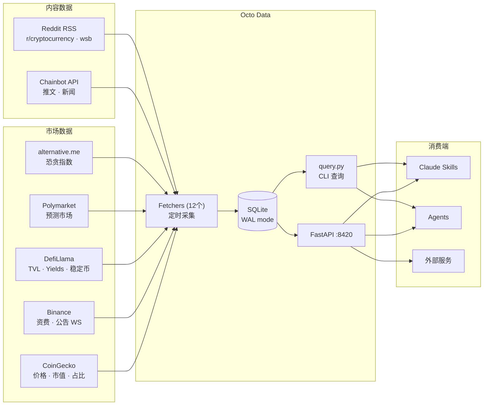

# Octo Data

独立的加密货币市场数据聚合服务。定时采集 → SQLite → FastAPI API。

## 架构



```
┌──────────────────────────────────────────────────────────────┐
│                        数据流                                 │
│                                                              │
│  15min  ─── prices ──────────┐                               │
│  15min  ─── funding_rates ───┤                               │
│   1h   ─── fear_greed ──────┤                               │
│   1h   ─── stablecoin ──────┤      ┌────────┐  ┌─────────┐ │
│   1h   ─── dominance ──────┼──▶  │ SQLite │──▶│  API    │ │
│   1h   ─── defi_tvl ───────┤      │  (WAL) │  │  :8420  │ │
│   1h   ─── defi_yields ────┤      └────────┘  └─────────┘ │
│   1h   ─── polymarket ─────┤          │                     │
│  30min  ─── tweets ─────────┤          ▼                     │
│  30min  ─── kb_news ────────┤   query.py (CLI)              │
│   1h   ─── reddit ─────────┤                               │
│  实时   ─── announcements ──┘                               │
│                                                              │
│  30min  ─── classifier ──▶ topics 标签（haiku）               │
└──────────────────────────────────────────────────────────────┘
```

## 数据源

| Fetcher | 频率 | 来源 | 说明 |
|---------|------|------|------|
| prices | 15min | CoinGecko | BTC/ETH/SOL 等 14 币价格 |
| funding_rates | 15min | Binance Futures | 9 个合约资金费率 |
| fear_greed | 1h | alternative.me | 恐贪指数 |
| stablecoin | 1h | DefiLlama | 8 个稳定币供应量 |
| dominance | 1h | CoinGecko | BTC/ETH 等市值占比 |
| defi_tvl | 1h | DefiLlama | Top 10 链 TVL |
| defi_yields | 1h | DefiLlama | DeFi 收益池（>$10M TVL） |
| polymarket | 1h | Polymarket Gamma API | 预测市场赔率 |
| tweets | 30min | Chainbot API | KOL 推文 |
| kb_news | 30min | Chainbot API | 新闻（Odaily 等） |
| reddit | 1h | Reddit RSS | r/cryptocurrency, r/wallstreetbets |
| announcements | 实时 | Binance WebSocket | 币安公告（上新/下架/空投/活动） |
| classifier | 30min | claude --print (haiku) | 文本分类：defi/earn/crypto/stock/macro/ai |

## 快速开始

```bash
# 1. 安装依赖
pip install -r requirements.txt

# 2. 配置
cp .env.example .env
# 编辑 .env，至少填 COINGECKO_API_KEY 和 BINANCE_API_KEY/SECRET

# 3. 启动
python main.py

# 4. 验证
curl http://localhost:8420/status
curl http://localhost:8420/prices/latest
```

## Docker

```bash
docker build -t octo-data .
docker run -d --name octo-data -p 8420:8420 --env-file .env octo-data
```

## CLI 查询

```bash
python3 query.py prices latest
python3 query.py yields top --type usd
python3 query.py funding latest
python3 query.py fear latest
python3 query.py announcements latest
python3 query.py polymarket macro
python3 query.py tweets latest
python3 query.py news search "Ethereum"
python3 query.py text "airdrop"                   # 跨表全文搜索
python3 query.py status
```

## API 端点

| 端点 | 说明 |
|------|------|
| `GET /prices/latest` | 最新价格 |
| `GET /prices?symbol=BTC&from=2026-03-01` | 价格历史 |
| `GET /funding-rates/latest` | 最新资金费率 |
| `GET /fear-greed/latest` | 恐贪指数 |
| `GET /stablecoin/latest` | 稳定币供应 |
| `GET /dominance/latest` | 市值占比 |
| `GET /defi-tvl/latest` | 链级 TVL |
| `GET /defi-yields/latest` | DeFi 收益 |
| `GET /defi-yields/top?asset_type=usd` | Top 收益池 |
| `GET /defi-yields/pool/{pool_id}` | 单池历史 |
| `GET /announcements/latest` | 最新公告 |
| `GET /announcements?catalog=New+Cryptocurrency+Listing` | 按分类查公告 |
| `GET /polymarket/latest` | Top 20 预测市场 |
| `GET /polymarket/movers` | 24h 大波动 |
| `GET /polymarket/macro` | 宏观信号 |
| `GET /polymarket/search?keyword=bitcoin` | 搜索市场 |
| `GET /tweets/latest` | 最新推文 |
| `GET /tweets?username=X&keyword=Y` | 搜索推文 |
| `GET /kb-news/latest` | 最新新闻 |
| `GET /kb-news?keyword=Y&source=Odaily` | 搜索新闻 |
| `GET /reddit/latest` | Reddit 热帖 |
| `GET /text/search?keyword=bitcoin` | 跨表全文搜索 |
| `GET /signals?topics=earn,defi&hours=4` | 按 topic 跨表信号查询 |
| `GET /status` | 系统状态 |

所有端点返回 `{"data": [...], "total": N}`。
